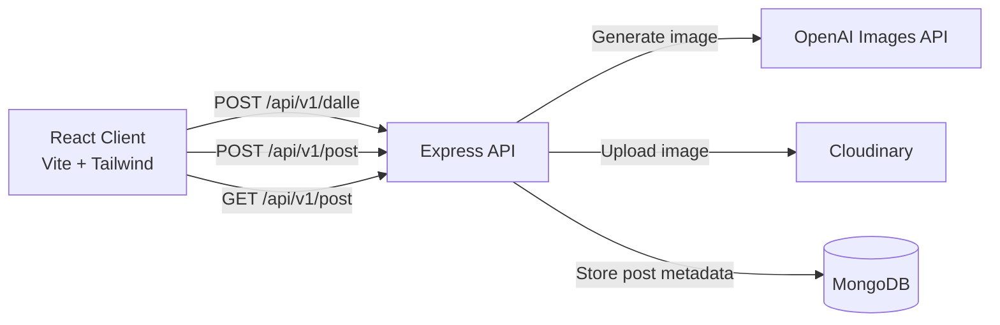

# AI Image Gen

Full-stack MERN application for generating AI images from text prompts, publishing them to a community feed, and downloading results.

<p align="center">
	
	
	
	
	
	
	
	
</p>

## Project Overview

This project provides an end-to-end image generation experience:

1. User enters a prompt.
2. Backend requests an AI-generated image from OpenAI.
3. Image is returned as Base64 and shown in the UI.
4. User shares the image to the community.
5. Backend uploads to Cloudinary and stores metadata in MongoDB.
6. Community feed fetches and renders all posts.

## Key Features

- Prompt-based AI image generation.
- Surprise prompt helper for quick inspiration.
- Community feed with searchable posts.
- Cloud-based image hosting via Cloudinary.
- Download generated images from the feed.
- Responsive React + Tailwind interface.

## Architecture



## Repository Structure

```text
project_ai_mern_image_generation/
|- client/                       # React + Vite frontend
|  |- src/
|  |  |- components/             # Reusable UI components
|  |  |- page/                   # Route pages (Home, CreatePost)
|  |  |- utils/                  # Prompt helpers and download utility
|- server/                       # Express backend
|  |- mongodb/
|  |  |- models/                 # Mongoose schemas
|  |- routes/                    # API routes (dalle, post)
|- README.md
```

## Tech Stack

| Layer | Technology |
|---|---|
| Frontend | React 18, Vite 4, Tailwind CSS, React Router |
| Backend | Node.js, Express |
| Database | MongoDB + Mongoose |
| AI | OpenAI Images API |
| Media Storage | Cloudinary |

## API Endpoints

Base URL (backend): `http://localhost:8080`

| Method | Endpoint | Description |
|---|---|---|
| GET | `/` | Health-style message from API |
| GET | `/api/v1/dalle` | Route check message |
| POST | `/api/v1/dalle` | Generate an image from a text prompt |
| GET | `/api/v1/post` | Get all community posts |
| POST | `/api/v1/post` | Create and store a post |

### Example Request: Generate Image

```http
POST /api/v1/dalle
Content-Type: application/json

{
	"prompt": "A cinematic neon city floating above the clouds"
}
```

### Example Request: Create Post

```http
POST /api/v1/post
Content-Type: application/json

{
	"name": "Daksh",
	"prompt": "A cinematic neon city floating above the clouds",
	"photo": "data:image/jpeg;base64,..."
}
```

## Local Development Setup

### 1. Prerequisites

- Node.js 18+
- npm 9+
- MongoDB connection string
- OpenAI API key
- Cloudinary credentials

### 2. Install Dependencies

```bash
cd client
npm install

cd ../server
npm install
```

### 3. Configure Environment Variables

Create `server/.env`:

```env
MONGODB_URL=your_mongodb_connection_string
OPENAI_API_KEY=your_openai_api_key
CLOUDINARY_CLOUD_NAME=your_cloud_name
CLOUDINARY_API_KEY=your_cloudinary_api_key
CLOUDINARY_API_SECRET=your_cloudinary_api_secret
```

### 4. Run the Application

Start backend (Terminal 1):

```bash
cd server
npm start
```

Start frontend (Terminal 2):

```bash
cd client
npm run dev
```

Frontend default URL: `http://localhost:5173`

## Important Note For Local Full-Stack Use

The frontend currently calls a deployed backend URL in:

- `client/src/page/Home.jsx`
- `client/src/page/CreatePost.jsx`

If you want the frontend to use your local backend, replace:

- `https://dalle-arbb.onrender.com`

with:

- `http://localhost:8080`

## Production Considerations

- Move API base URL to an environment variable (frontend).
- Add request validation and rate limiting on backend routes.
- Add auth for create-post actions.
- Add loading/error telemetry and structured logging.
- Pin and regularly update dependencies for security patches.
